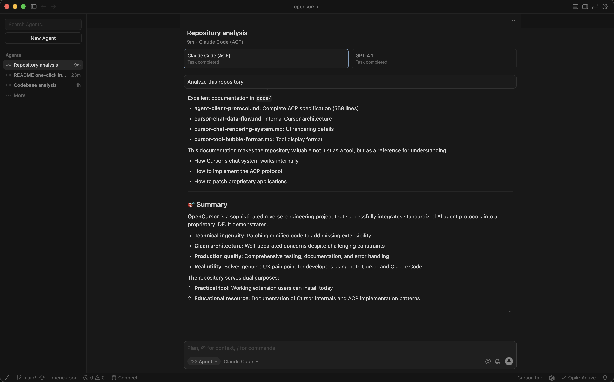

<div align="center">
  
  <h1>Agents for Cursor</h1>
  <p><strong>Use Claude Code directly in Cursor's chat sidebar</strong></p>

  <p>
    <a href="#features">Native Integration</a> •
    <a href="#features">Tool Calls in UI</a> •
    <a href="#features">Conversation History</a>
  </p>

  <a href="cursor:extension/jverre.agents-for-cursor">
    
  </a>

  <br/><br/>

  
</div>

---

## Quickstart

> [!WARNING]
> This extension works by modifying core Cursor files and may corrupt the installation.

1. **Install the extension**: <a href="cursor:extension/jverre.agents-for-cursor">Click here to install</a> or search for "Agents for Cursor" in the extensions tab
2. **Enable and restart**: You'll be prompted to enable the extension and restart Cursor
3. **Setup Claude Code**: Install [Claude Code](https://docs.anthropic.com/en/docs/agents-and-tools/claude-code/overview) and run `/login` to authenticate

You can now use Claude Code directly from the Cursor chat sidebar!

---

## Features

<table>
<tr>
<td align="center" width="50%">
  <br/>
  <strong>Tool Calls Display</strong><br/>
  <sub>Tool bubbles render natively in Cursor's chat</sub>
</td>
<td align="center" width="50%">
  <br/>
  <strong>Code Search</strong><br/>
  <sub>Grep, glob, and file search with rich results</sub>
</td>
</tr>
<tr>
<td align="center" width="50%">
  <br/>
  <strong>Slash Commands</strong><br/>
  <sub>/init, /security-review, and custom commands</sub>
</td>
<td align="center" width="50%">
  <br/>
  <strong>Plan Mode</strong><br/>
  <sub>Plan file detection and rendering</sub>
</td>
</tr>
</table>

**Additional Features:**
- Claude Code available in model selector for chat sidebar and Agent UI
- Conversation history maintained across messages
- **Real-time token & cost tracking** - See input/output tokens and USD cost directly on each message

---

## Token & Cost Tracking

Each message displays real-time token usage and cost from the Claude SDK:

```
↑17.6k ↓847 | $0.0141
```

- **↑ Input tokens**: Total tokens sent (includes system prompt, tools, conversation history, and cache)
- **↓ Output tokens**: Tokens generated by Claude
- **$ Cost**: Actual USD cost from Claude's API

Hover over the display for a detailed breakdown:
- Base input tokens (non-cached)
- Cache read tokens (previously cached context)
- Cache write tokens (newly cached content)

The token counts update in real-time as Claude streams its response, with final authoritative values shown when the response completes.

---

<details>
<summary><strong>Coming Soon</strong></summary>

- [ ] `/login` command support
- [ ] Tool call permission prompts
- [ ] Agent, Plan, Ask mode switching
- [ ] Multiple Claude Code model versions

</details>

---

## Advanced

The extension surfaces commands to manage the extension:
- **Disable**: Open command palette (`Shift+Cmd+P`) and run `Agents for Cursor: Disable`
- **Enable**: Open command palette (`Shift+Cmd+P`) and run `Agents for Cursor: Enable`

---

## Contributions

This extension is a work in progress! If you have feedback or run into issues, just [open a GitHub issue](https://github.com/jverre/agents-for-cursor/issues) and I'll take a look.

PRs are welcome!
